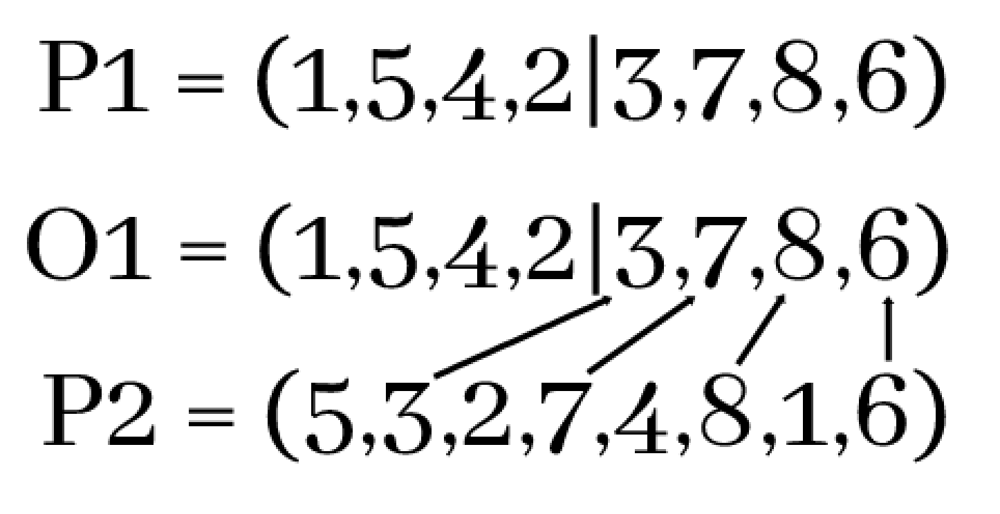

# Travelling Salesman Problem Solver

## Problem Description

Given a set of cities, find the shortest route that passes through every city and returns to origin.

## Seems easy?

Yeah, but it's not. It's one of the NP-hard problems (more [here](https://en.wikipedia.org/wiki/NP-hardness)), which basically means that we do not have an efficient algorithm to do this. In this app, you can see several different approaches towards this problem.

## **Algorithms**

### _Random_

That one is pretty self-explanatory. The algorithm randomizes a path a given number of times and chooses the best one.

### _Greedy_

1. Select a city and mark it as visited
2. Find a closest unvisited city
3. Move to this found city and mark it as visited
4. Repeat steps 2. and 3. until the path is complete

### _Hill Climbing_

1. Create a random path.
2. Find all possible paths created by switching the order of two cities.
3. Select the shortest found path.
4. Repeat steps 2. and 3. until the best found path is worse than current one (local minimum has been reached).

### _Simulated Annealing_

1. Create a random path.
2. Switch the order of two random cities.
3. If the created path is shorter than current one, select it.
4. Otherwise, accept the created path with a probability of `1/T` where T is current iteration.
5. Repeat steps 2. and 3. for a given amount of iterations.

### _Genetic Algorithm_

1. Create a population of random paths.
2. Select the best half of the population.
3. Create offsprings using a crossover operation, as shown below (P1, P2 are parents, O1 is an offspring).
   
4. Offsprings are mutated with a 20% chance, by switching the order of two random cities.
5. Repeat steps 2., 3. and 4. for a given amount of generations.

## Running on you own machine

To run the app, just clone the repo and run:

### `npm start`
